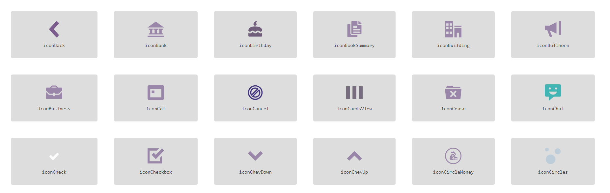
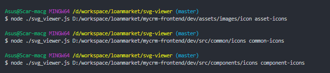

# Simple Image/SVG Viewer
### Simply loads the images or files in the passed directory and creates an HTML file for it to be rendered.

## How to use : 
1. Download `svg-viewer` project
2. Locate `svg-viewer` project directory in cmd
3. Run `node svg_viewer /path/to/icon_directory`
```
  node svg_viewer /d/workspace/myProject/icons
```
4. Open `svg_viewer.html` in browser. Viola! 
5. Optional you may add 3rd param in command for the custom file name. Sample will create `my-project-icons.html` file instead of the default.
```
  node svg_viewer /d/workspace/myProject/icons my-project-icons
```

PS. This only supports one path at a time... watch out for multi paths update. :D

### Feel free to adjust the design according to your preference.



## Sample Usage for Nultiple Icon Directories

